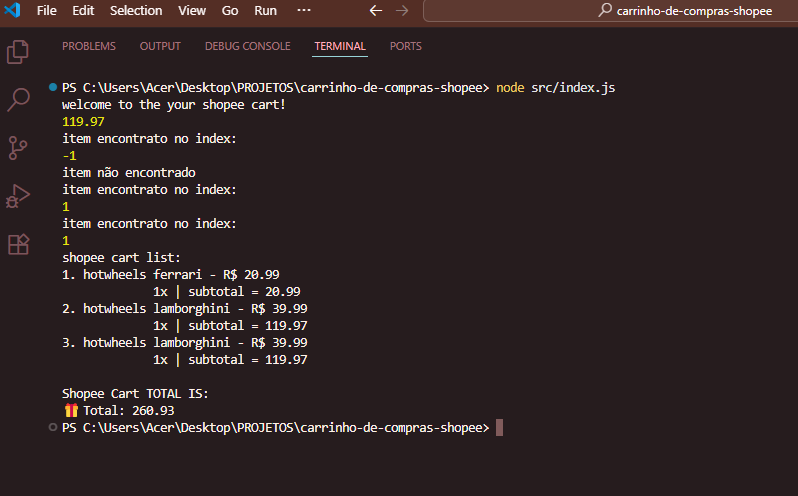

# 🖼️ Sobre o Projeto

# 🛒 Carrinho de Compras com JavaScript e Node.js

Este projeto é uma aplicação de carrinho de compras desenvolvida com **JavaScript** no frontend e **Node.js** no backend. O objetivo é simular o processo de adicionar, remover e gerenciar produtos em um carrinho, utilizando princípios básicos de desenvolvimento web e manipulação de dados em tempo real.

## 🚀 Funcionalidades

- Adicionar produtos ao carrinho
- Remover produtos do carrinho
- deletar produtos do carrinho
- Calcular total do pedido

## 🛠 Tecnologias Utilizadas

- [JavaScript (ES6+)](https://developer.mozilla.org/pt-BR/docs/Web/JavaScript)
- [Node.js](https://nodejs.org/)

## 📁 Estrutura do Projeto
 
 

